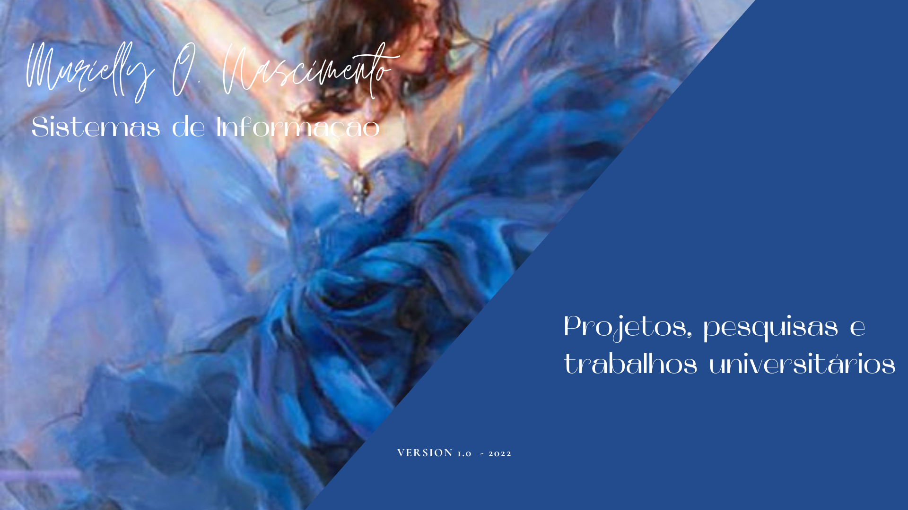

<!--
**Murielly-Nascimento/Murielly-Nascimento** is a ✨ _special_ ✨ repository because its `README.md` (this file) appears on your GitHub profile.

Here are some ideas to get you started:

- 🔭 I’m currently working on ...
- 🌱 I’m currently learning ...
- 👯 I’m looking to collaborate on ...
- 🤔 I’m looking for help with ...
- 💬 Ask me about ...
- 📫 How to reach me: ...
- 😄 Pronouns: ...
- ⚡ Fun fact: ...
-->

<body>
    <header></header>
    <main>
        <article>
            <section>
                <h3>Bem vindo!</h3>
                
Sou uma estudante de Sistemas de Informação na UFU. Participo do PET-SI há dois anos
                    e desde que ingressei na faculdade venho desenvolvendo projetos de caráter social e
                    acadêmico. No momento estou trabalhando com desenvolvendo web e programação competitiva.
                

            </section>
            <section>
                <h3>Meus favoritos</h3>
                <ul>
                    <li>🔭 Minha linguagem do momento é C++</li>
                    <li> 🌱 Amo ler e ouvir música nas horas vagas</a></li>
                    <li>⚡ Fun fact: Cursei dois semestres de Relações Internacionais antes de migrar para Sistemas</li>
                </ul>
            </section>
            <section>
                <h3>Github Stats</h3>
                

                    <a href="https://github.com/Murielly-Nascimento">
                    
                    
                

            </section>
        </article>
    </main>
</body>
